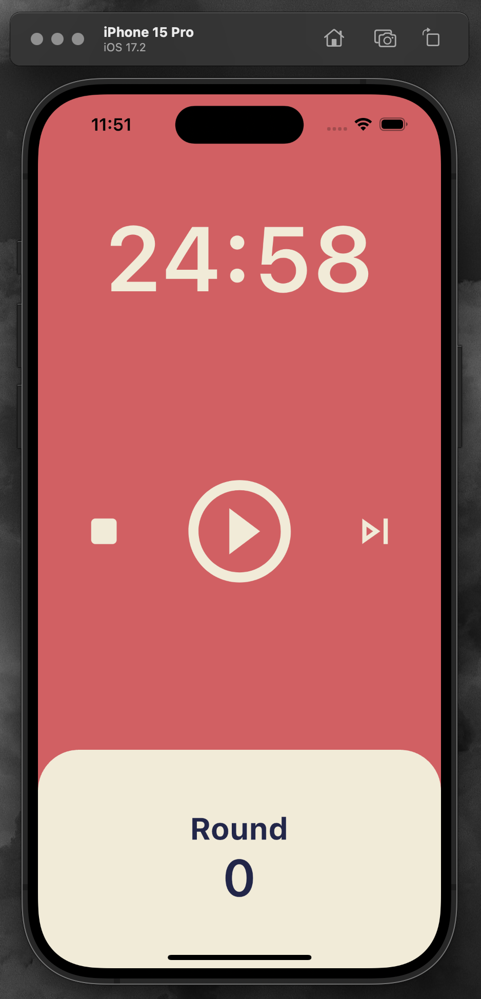

# Pomodoro Timer App

## 프로젝트 소개

이 앱은 집중력 향상을 돕는 포모도로 기법을 기반으로 한 타이머 앱의 코드를 담고 있습니다. 사용자는 25분 동안 집중한 후 5분간 휴식하는 기본 포모도로 타이머 사이클을 경험할 수 있습니다.

## 주요 기능

- **타이머**: 25분의 작업 시간과 5분의 휴식 시간을 측정합니다.

- **라운드 표시**: 사용자가 몇 라운드의 포모도로 사이클을 완료했는지 보여줍니다.

- **재생/일시정지**: 타이머를 시작하거나 중지할 수 있는 컨트롤을 제공합니다.

## 기술적 구현

- **Flutter**: 이 앱은 Flutter로 개발되어 안드로이드와 iOS 모두에서 사용할 수 있습니다.

- **사용자 인터페이스**: 직관적인 UI를 통해 사용자가 쉽게 타이머를 설정하고 관리할 수 있도록 합니다.

- **상태 관리**: 앱의 상태는 사용자가 타이머를 조작할 때마다 실시간으로 업데이트됩니다.

